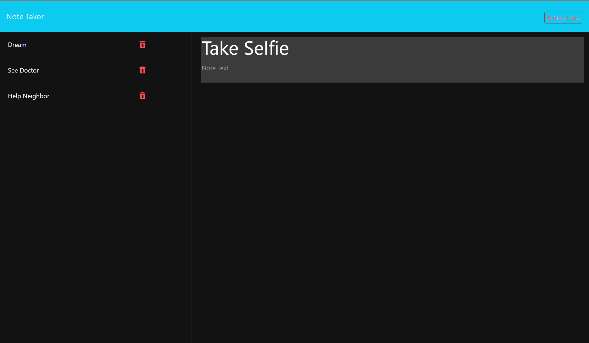

# Note_TakerWJ

## Description

In this project we finished the code to create a notetaker app. The frontend of the application was created for us so we were tasked with completing the backend/server side of the application. We did this using javascript and express js. As a coder I was able to write a code that allows the user to take notes with titles and save them to a db.json file. I also gave the user the ability to delete notes that were not needed. This challenge was a good introduction to how we will be creating our apps in the future and coding both the front end and the backend.

## Repository

Link to render: 

## Technologies

- Written with JavaScript and ExpressJS 

## License

MIT License

## Mock-Up

The following image shows the application's functionality and appearance:

